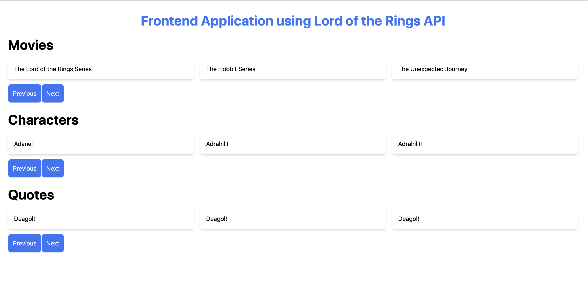

# Installing the dependencies

From the project root, run:

### `yarn`  or `npm i` to install the dependencies

#
# Running the App

From the project root, run:

### `yarn start` or `npm run start` to start the application in the development mode.
Open [http://localhost:3000](http://localhost:3000) to view it in the browser.

The page will reload if you make edits.\
You will also see any lint errors in the console.
#
# Running the Unit Tests

From the project root, run:

### `yarn test`

Launches the test runner in the interactive watch mode.

